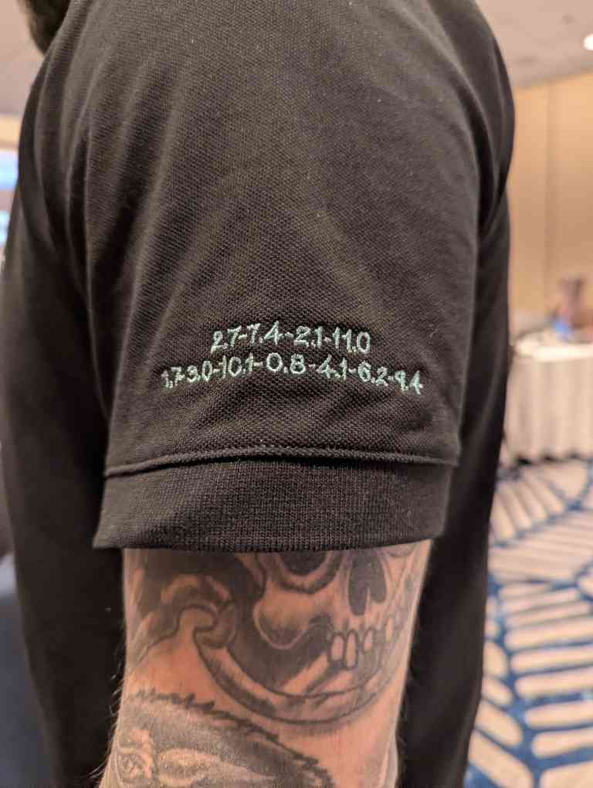
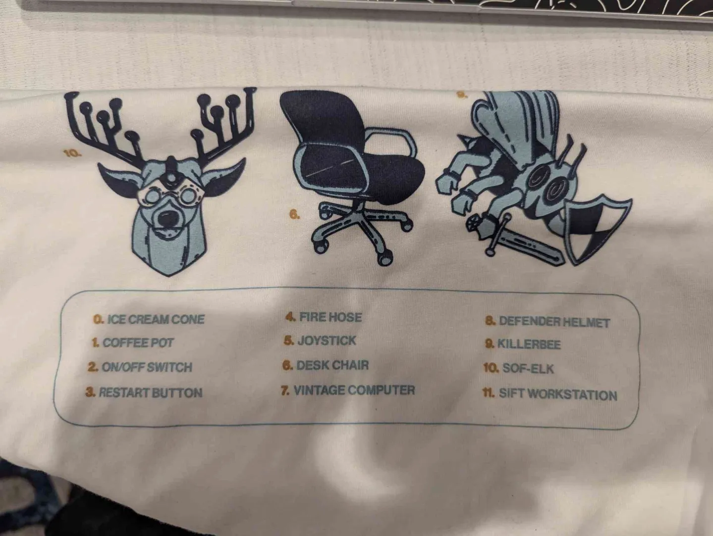

# Shirt "CTF" Writeup
uhhhhhhhh. so i got the flag lol. as the person with a confirmed writeup, plz give me prize :D
In all seriousness, if don't get cloud pen for free, I'm going to crash out.

## Step #1: Get the shirt
As hinted throughout the conference, the shirt was going to be used for a competition, so picking it 
up from registration is critical.

## Step #2: Locating the puzzle
Each instructor was told to wear a special shirt on April 1st (you could have gotten this info with 
basic SE or if you have ears ngl). Since that date corresponds with the day of the competition, we can assume
that the shirt is part of the challenge. 

## Step #3: Finding the puzzle
After looking Rich Greene's shirt intensively (in a not weird way), I was able to find the puzzle on his left sleeve.
Assuming the shirt is uniform, all instructor shirts should have it on the left. I have attached a picture below of how it looks like:

## Step #4: Decoding the puzzle
With the puzzle, I was able to immediately deduce the instructor puzzle and shirt are related since I had no other clues. Looking at the puzzle,
you can see that the number before the dot goes up to 11, which is awfully similar to the shirt, which has 11 pictures on it.

Knowing this, I was able to deduce that the number before the dot indicated the picture and the number after the dot indicated the character (starting from index 0).
With this information, I was able to map each part of the puzzle to a char:

FLAG SPOILERS BELOW

Click to reveal the letter hints

2.7 - " S"  
7.4 - "A"  
2.1 - "N"  
11.0 - "S"  

1.7 - "P"  
3.0 - "R"  
10.1 - "O"  
0.8 - "M"  
4.1 - "I"  
6.2 - "S"  
9.4 - "E"  

Therefore, the flag is:

Click to reveal the flag

SANS PROMISE

And yeah, thats how you do the SANS 2026 Shirt Challenge.

## Step #5: Win Netwars?
If you are a CTFer and/or cracked out of your mind, please DM me on Slack/Linkedin/Discord if you would like to join my team. I'm trying to win non-military ToC
and I can't do it solo.
